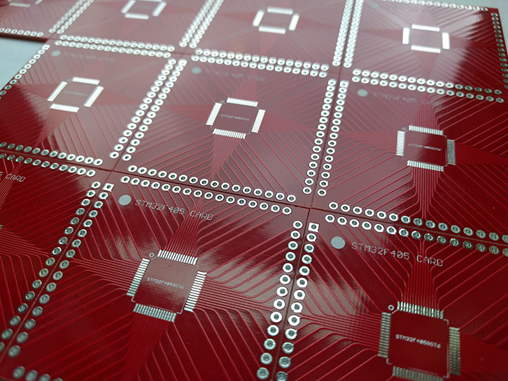
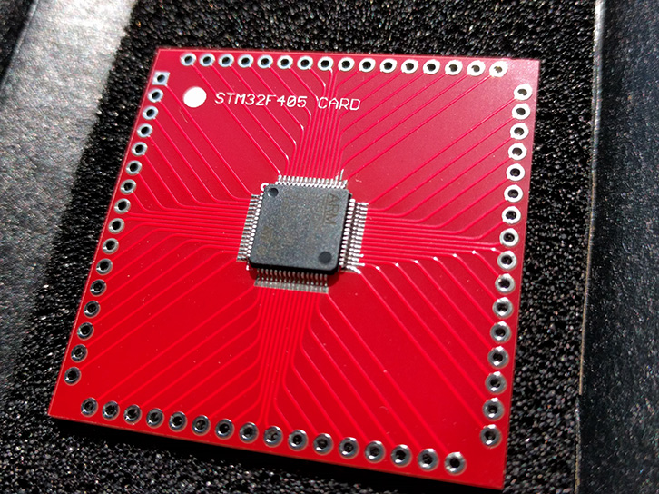
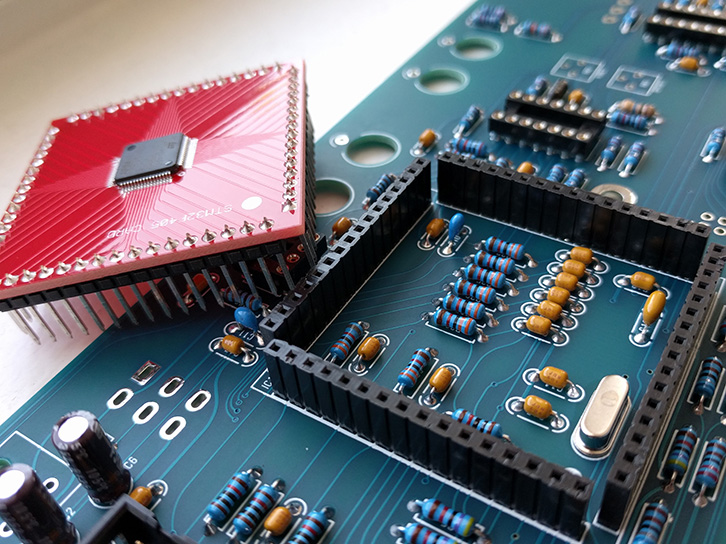

# STM32F405 Microcontroller Card

ARM STM32F405 microcontroller SMT to though-hole adapter card for the Touch Activated Voltage Source Model 218 Rev2.0 Buchla clone.

This repo contains the EAGLE board and schematic files along with the generated Gerber files.

## STM32F405 card

STM32F405 cards fresh from the PCB fab house

Card with the microcontroller installed

Finished card with the 218 Rev 2.0

## BOM

| Value   | QTY | Description | Mouser Part # |
|:--------|:---:|:------------|:--------------|
| STM32F405RGT6 | 1 | ARM Microcontroller - MCU ARM M4 1024 FLASH 168 Mhz 192kB SRAM | [511-STM32F405RGT6][arm_mcu] |
|  | 4 | Pin Strip Header - 16 Pin (Male) | [517-929700-01-16][pin_header] |

[arm_mcu]: https://www.mouser.com/ProductDetail/511-STM32F405RGT6
[pin_header]: https://www.mouser.com/ProductDetail/517-929700-01-16